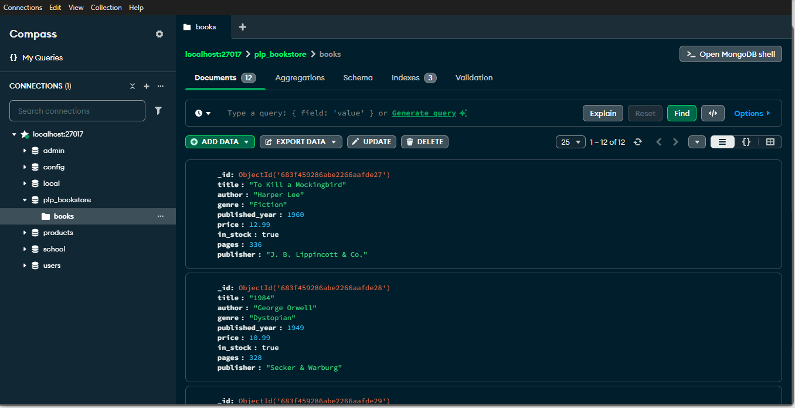

📚 PLP Bookstore – MongoDB Indexing & Query Performance Analysis

This project demonstrates how to create indexes in MongoDB using Node.js and analyze their effect on query performance using the `explain()` method.

## 🔧 Requirements

- Node.js (v14 or later)
- MongoDB running locally on `mongodb://localhost:27017`
- A `books` collection in the `plp_bookstore` database

## 📁 Setup Instructions

1. **Install dependencies**  
   ```bash
   npm install mongodb

2. Ensure MongoDB is running

On Windows: Start MongoDB service or run mongod

On Linux/macOS: sudo systemctl start mongod or use Brew

🧠 What the Script Does
Connects to the plp_bookstore database

Creates:

1. A single field index on title

2. A compound index on author and published_year

3. Lists all indexes in the books collection

4. Compares query performance:

Full collection scan (no index)
Indexed query

5. Logs:
executionTimeMillis

totalDocsExamined

📸 Screenshot
Below is a mongo compass screenshot showing successful insert, index creation and performance analysis


📂 File Structure

plp_bookstore/
├── index-analysis.js
├── README.md
├── screenshot-output.png
└── node_modules/

👨‍💻 Author
@MellonP
MongoDB + Node.js Student
South Africa
